# Documentation for the AHA parcellation scripts

The following documentation refers to the scripts ``example_aha_parcellation.m`` and ``example_extended_aha_parcellation.m``.  
Both parcellations are extentions of the AHA segmentation described in [M.D. Cerqueira et al., Circulation. 2002;105:539–542](https://doi.org/10.1161/hc0402.102975).

## Illustration of the results

**On geo2:**
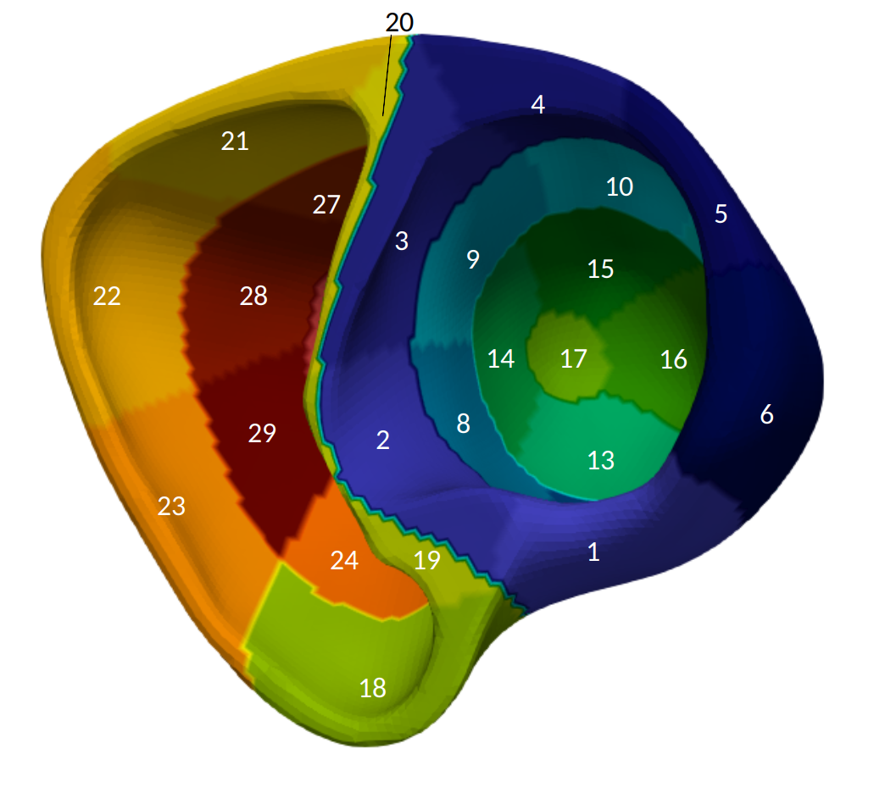
*Fig 1.1 Above View (Left Tilt)*
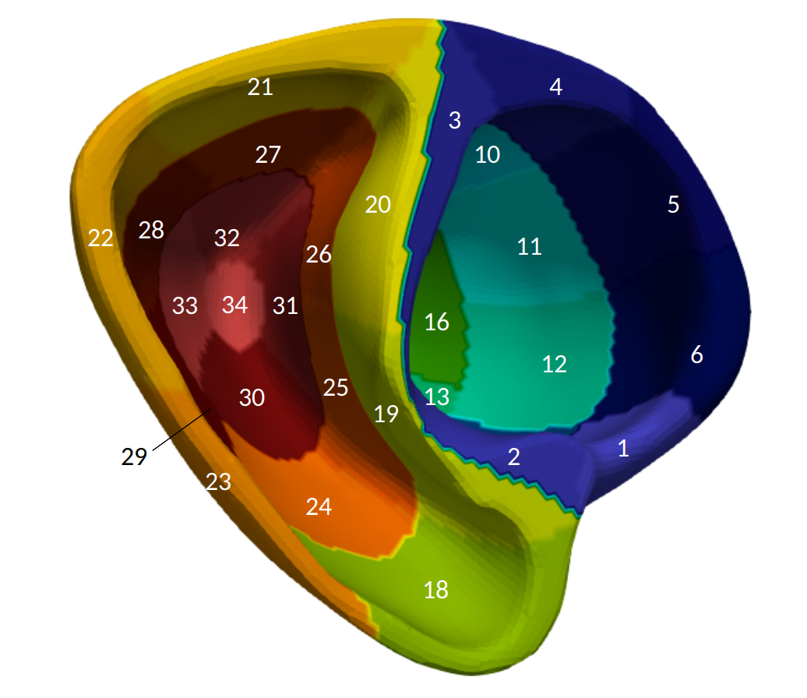
*Fig 1.2 Above View (Right Tilt)*
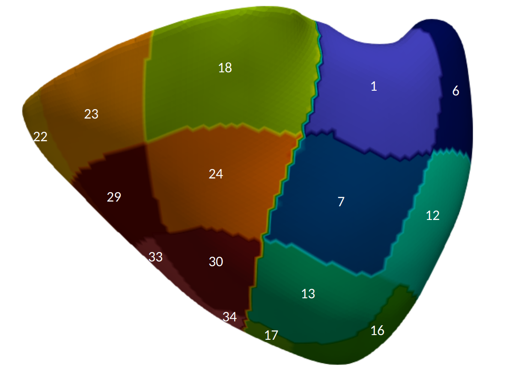
*Fig 1.3 Anterior Side View*
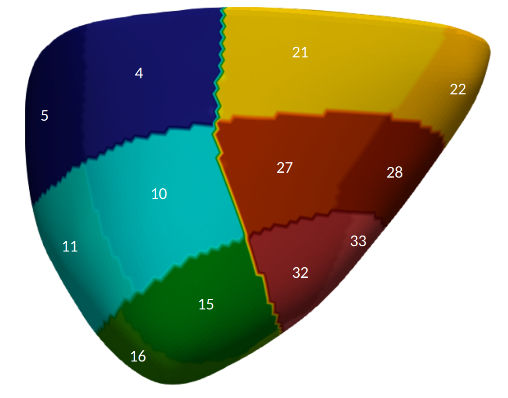
*Fig 1.4 Inferior Side View*
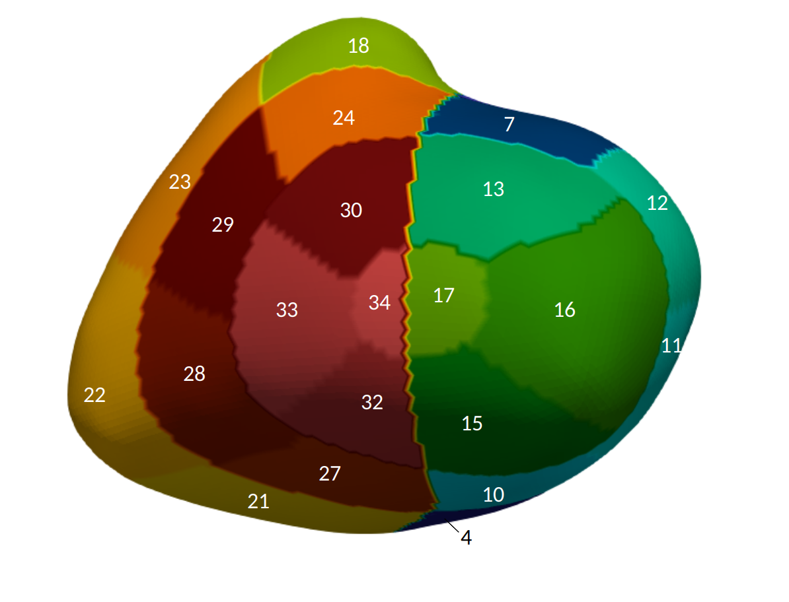
*Fig 1.5 Below View*

**On meanTOF:**
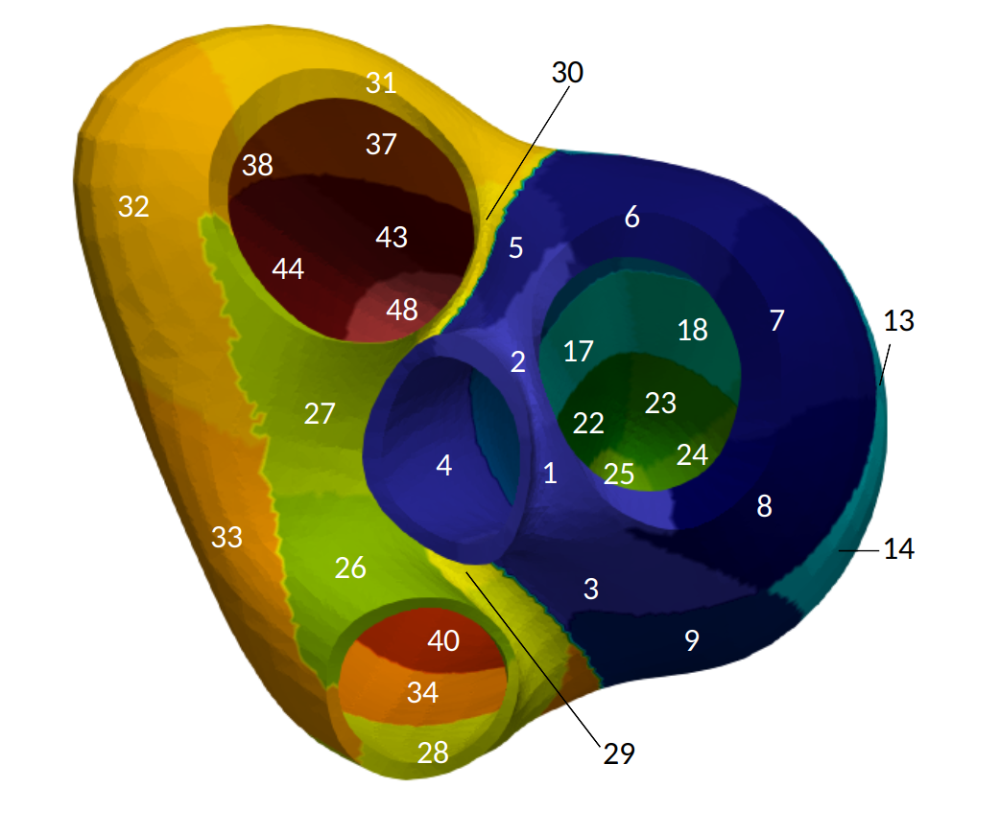
*Fig 2.1 Above View*
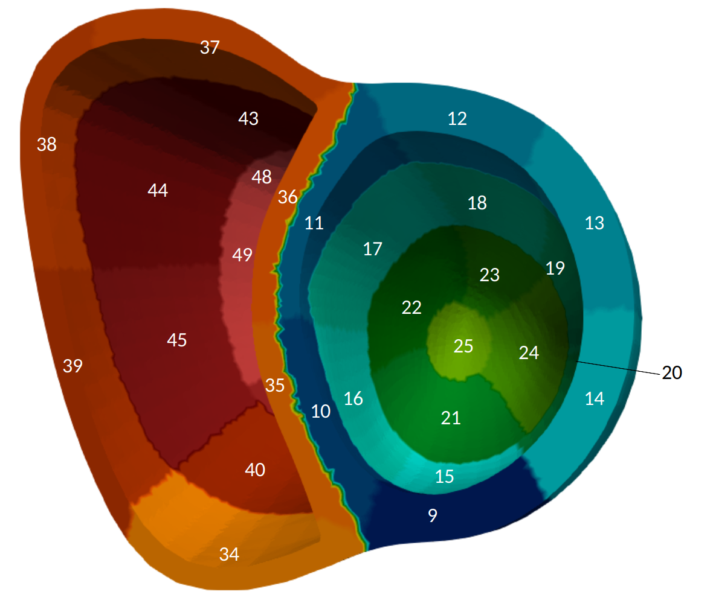
*Fig 2.2 Above View (Cut, Left Tilt)*git
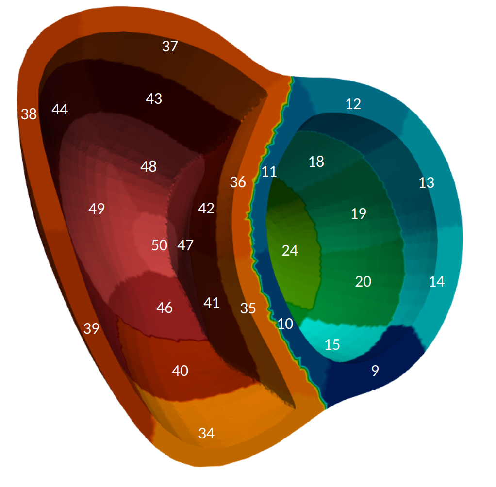
*Fig 2.3 Above View (Cut, Right Tilt)*
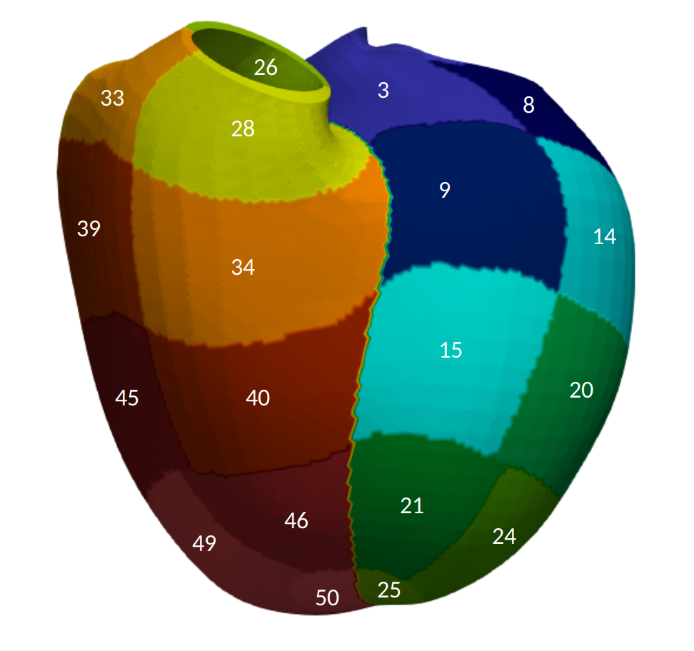
*Fig 2.4 Anterior Side View*
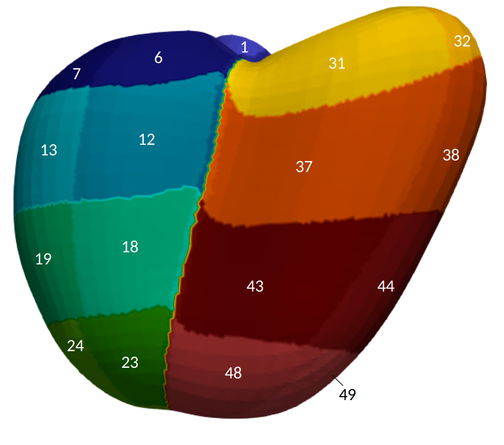
*Fig 2.5 Inferior Side View*
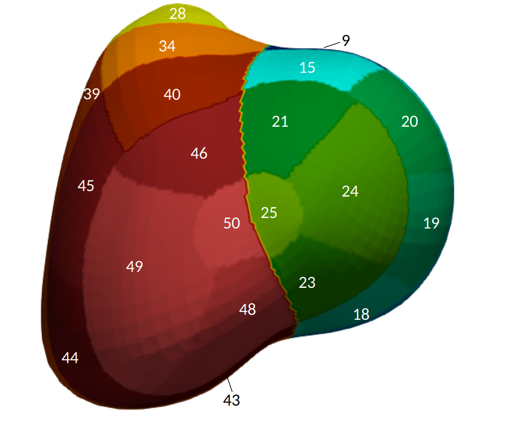
*Fig 2.6 Below View*

## Explanation on how the regions were chosen to be defined

- RV: We chose to take same sections as for the lv, extending the model.
- Anatomically detailed base added and divided in six sections following the model from the article.
- Intervalvular bridges: Divided into anterior and inferior.

For the following explanation, one can refer to the tables here under.

- The vertical segmentation followed the rule in the article: apical region 40% (10% apex + 30% apical), mid region 30% and basal 30%, which translated to intervals $[0, \frac{1}{10})$ for the apex, $[\frac{1}{10}, \frac{4}{10})$ for apical, $[\frac{4}{10}, \frac{7}{10})$ for mid and $[\frac{7}{10}, 1]$ for basal in the original version without the bridges.  
The extension worked in a similar way: the sections from the other model were the ones with apicobasal coordinate in the interval $[0, \frac{4}{5}]$ and were then divided still in 10% + 30% + 30% + 30%, resulting in intervals $[0, \frac{2}{25}]$ for the apex, $(\frac{2}{25}, \frac{8}{25}]$ for apical, $(\frac{8}{25}, \frac{14}{25}]$ for mid and $(\frac{14}{25}, \frac{4}{5}]$ for basal. The base had apicobasal coordinate in the interval $(\frac{4}{5}, 1]$ and the intervalvular regions had it above 1.
- The horizontal segmentation had a different approach in the two models: in the original model the sections just followed the rotational coordinate and were divided in six for the basal and mid section and in four for the apical section.
For basal and mid, the anterior region has rotational coordinate in interval $[\frac{1}{2}, \frac{2}{3})$, the anteroseptal $[\frac{2}{3}, \frac{5}{6})$, the inferoseptal $[\frac{5}{6}, 1)$, the inferior $[0, \frac{1}{6})\cup \{1\}$, the inferolateral $[\frac{1}{6}, \frac{1}{3})$ and the anterolateral $[\frac{1}{3}, \frac{1}{2})$.  
For the apical region we noticed that the septal and the lateral regions are in the middle of the antero- and inferoseptal and -lateral respectively, so summing fractions we defined the following intervals:  $[\frac{11}{24}, \frac{17}{24})$ for the anterior, $[\frac{17}{24}, \frac{23}{24})$ for the septal, $[\frac{23}{24}, 1]\cup[0, \frac{5}{24})$ for the inferior and $[\frac{5}{24}, \frac{11}{24})$ for the lateral.  
In the model with anathomically detailed base, we noticed that the septal area had rotational coordinates between 0.58 and 1, we divided it into two intervals, $[\frac{29}{50}, \frac{71}{100})$ for anteroseptal and $[\frac{71}{100}, 1)$ for inferoseptal. The rest was divided in four intervals of the same length, resulting in coordinates in interval $[0, \frac{29}{200})\cup\{1\}$ for inferior, $[\frac{29}{200}, \frac{29}{100})$ for inferolateral, $[\frac{29}{100}, \frac{87}{200})$ for anterolateral and finally $[\frac{87}{200}, \frac{29}{50})$ for anterior.
The intervalvular region in the right ventricle had rotational coordinate between -0.1 to 1, so the split between anterior and inferior was achieved with intervals $[-\frac{1}{10}, \frac{9}{20})$ for anterior and $[\frac{9}{20}, 1]$ for inferior.
For the intervalvular region in the left ventricle we chose to look at the apicobasal coordinate, because the rotational one was splitting the are into left and right instead of anterior and inferior. $[1, \frac{6}{5}]$ was the interval for inferior and above $\frac{6}{5}$ for anterior. 

## Table of aha parcellation

| Name of region | Number assigned | tv coordinate | ab coordinate | rt coordinate | 
|----------------|-----------------|---------------|---------------|---------------|
| Basal anterior (LV)| 1 | 0 |$\frac{7}{10}$ < ab ≤ $1$| $\frac{1}{2}$ ≤ rt < $\frac{2}{3}$|
| Basal anteroseptal (LV)| 2 | 0 | $\frac{7}{10}$ < ab ≤ $1$| $\frac{2}{3}$ ≤ rt < $\frac{5}{6}$|
| Basal inferoseptal (LV)| 3 | 0 | $\frac{7}{10}$ < ab ≤ $1$| $\frac{5}{6}$ ≤ rt < $1$|
| Basal inferior (LV)| 4 | 0 | $\frac{7}{10}$ < ab ≤ $1$| rt = $1$ or rt < $\frac{1}{6}$|
| Basal inferolateral (LV)| 5 | 0 |  $\frac{7}{10}$ < ab ≤ $1$| $\frac{1}{6}$ ≤ rt < $\frac{1}{3}$|
| Basal anterolateral (LV)| 6 | 0 | $\frac{7}{10}$ < ab ≤ $1$| $\frac{1}{3}$ ≤ rt < $\frac{1}{2}$|
| Mid anterior (LV)| 7 | 0 | $\frac{4}{10}$ < ab ≤ $\frac{7}{10}$| $\frac{1}{2}$ ≤ rt < $\frac{2}{3}$|
| Mid anteroseptal (LV) | 8 | 0 | $\frac{4}{10}$ < ab ≤ $\frac{7}{10}$| $\frac{2}{3}$ ≤ rt < $\frac{5}{6}$|
| Mid inferoseptal (LV) | 9 | 0 |$\frac{4}{10}$ < ab ≤ $\frac{7}{10}$| $\frac{5}{6}$ ≤ rt < $1$|
| Mid inferior (LV) | 10 | 0 |$\frac{4}{10}$ < ab ≤ $\frac{7}{10}$| rt = $1$ or  rt < $\frac{1}{6}$|
| Mid inferolateral (LV) | 11 | 0 | $\frac{4}{10}$ < ab ≤ $\frac{7}{10}$| $\frac{1}{6}$ ≤ rt < $\frac{1}{3}$|
| Mid anterolateral (LV) | 12 | 0 | $\frac{4}{10}$ < ab ≤ $\frac{7}{10}$| $\frac{1}{3}$ ≤ rt < $\frac{1}{2}$|
| Apical anterior (LV) | 13 | 0 | $\frac{1}{10}$ < ab ≤ $\frac{4}{10}$| $\frac{11}{24}$ ≤ rt < $\frac{17}{24}$|
| Apical septal (LV) | 14 | 0 | $\frac{1}{10}$ < ab ≤ $\frac{4}{10}$| $\frac{17}{24}$ ≤ rt < $\frac{23}{24}$|
| Apical inferior (LV) | 15 | 0 | $\frac{1}{10}$ < ab ≤ $\frac{4}{10}$| $\frac{23}{24}$ ≤ rt or rt < $\frac{5}{24}$ |
| Apical lateral (LV) | 16 | 0 | $\frac{1}{10}$ < ab ≤ $\frac{4}{10}$| $\frac{5}{24}$ rt < $\frac{11}{24}$|
| Apex (LV) | 17 | 0 | ab < $\frac{1}{10}$| N/A | 
| Basal anterior (RV)| 18 | 1 |$\frac{7}{10}$ < ab ≤ $1$| $\frac{1}{2}$ ≤ rt < $\frac{2}{3}$|
| Basal anteroseptal (RV)| 19 | 1 | $\frac{7}{10}$ < ab ≤ $1$| $\frac{2}{3}$ ≤ rt < $\frac{5}{6}$|
| Basal inferoseptal (RV)| 20 | 1 | $\frac{7}{10}$ < ab ≤ $1$| $\frac{5}{6}$ ≤ rt < $1$|
| Basal inferior (RV)| 21 | 1 | $\frac{7}{10}$ < ab ≤ $1$| rt = $1$ or rt < $\frac{1}{6}$|
| Basal inferolateral (RV)| 22 | 1 |  $\frac{7}{10}$ < ab ≤ $1$| $\frac{1}{6}$ ≤ rt < $\frac{1}{3}$|
| Basal anterolateral (RV)| 23 | 1 | $\frac{7}{10}$ < ab ≤ $1$| $\frac{1}{3}$ ≤ rt < $\frac{1}{2}$|
| Mid anterior (RV)| 24 | 1 | $\frac{4}{10}$ < ab ≤ $\frac{7}{10}$| $\frac{1}{2}$ ≤ rt < $\frac{2}{3}$|
| Mid anteroseptal (RV) | 25 | 1 | $\frac{4}{10}$ < ab ≤ $\frac{7}{10}$| $\frac{2}{3}$ ≤ rt < $\frac{5}{6}$|
| Mid inferoseptal (RV) | 26 | 1 |$\frac{4}{10}$ < ab ≤ $\frac{7}{10}$| $\frac{5}{6}$ ≤ rt < $1$|
| Mid inferior (RV) | 27 | 1 |$\frac{4}{10}$ < ab ≤ $\frac{7}{10}$| rt = $1$ or  rt < $\frac{1}{6}$|
| Mid inferolateral (RV) | 28 | 1 | $\frac{4}{10}$ < ab ≤ $\frac{7}{10}$| $\frac{1}{6}$ ≤ rt < $\frac{1}{3}$|
| Mid anterolateral (RV) | 29 | 1 | $\frac{4}{10}$ < ab ≤ $\frac{7}{10}$| $\frac{1}{3}$ ≤ rt < $\frac{1}{2}$|
| Apical anterior (RV) | 30 | 1 | $\frac{1}{10}$ < ab ≤ $\frac{4}{10}$| $\frac{11}{24}$ ≤ rt < $\frac{17}{24}$|
| Apical septal (RV) | 31 | 1 | $\frac{1}{10}$ < ab ≤ $\frac{4}{10}$| $\frac{17}{24}$ ≤ rt < $\frac{23}{24}$|
| Apical inferior (RV) | 32 | 1 | $\frac{1}{10}$ < ab ≤ $\frac{4}{10}$| $\frac{23}{24}$ ≤ rt or rt < $\frac{5}{24}$ |
| Apical lateral (RV) | 33 | 1 | $\frac{1}{10}$ < ab ≤ $\frac{4}{10}$| $\frac{5}{24}$ rt < $\frac{11}{24}$|
| Apex (RV) | 34 | 1 | ab ≤ $\frac{1}{10}$| N/A  | 

## Table of extended aha parcellation

| Name of region | Number assigned | tv coordinate | ab coordinate | rt coordinate | 
|----------------|-----------------|---------------|---------------|---------------|
| Intervalvular anterior (LV)| 1 | 0 | $\frac{5}{6}$ ≤ ab | N/A |
| Intervalvular inferior (LV)| 2 | 0 | $1$ < ab ≤ $\frac{5}{6}$| N/A |
| Base anterior (LV)| 3 | 0 | $\frac{4}{5}$ < ab ≤ $1$| $\frac{87}{200}$ ≤ rt < $\frac{29}{50}$|
| Base anteroseptal (LV)| 4 | 0 | $\frac{4}{5}$ < ab ≤ $1$| $\frac{29}{50}$ ≤ rt < $\frac{71}{100}$|
| Base inferoseptal (LV)| 5 | 0 | $\frac{4}{5}$ < ab ≤ $1$| $\frac{71}{100}$ ≤ rt < $1$|
| Base inferior (LV)| 6 | 0 | $\frac{4}{5}$ < ab ≤ $1$| rt = $1$ or rt < $\frac{29}{200}$|
| Base inferolateral (LV)| 7 | 0 |  $\frac{4}{5}$ < ab ≤ $1$| $\frac{29}{200}$ ≤ rt < $\frac{29}{100}$|
| Base anterolateral (LV)| 8 | 0 | $\frac{4}{5}$ < ab ≤ $1$| $\frac{29}{100}$ ≤ rt < $\frac{87}{200}$|
| Basal anterior (LV)| 9 | 0 | $\frac{14}{25}$ < ab ≤ $\frac{4}{5}$| $\frac{87}{200}$ ≤ rt < $\frac{29}{50}$|
| Basal anteroseptal (LV)| 10 | 0 | $\frac{14}{25}$ < ab ≤ $\frac{4}{5}$| $\frac{29}{50}$ ≤ rt < $\frac{71}{100}$|
| Basal inferoseptal (LV)| 11 | 0 | $\frac{14}{25}$ < ab ≤ $\frac{4}{5}$|  $\frac{71}{100}$ ≤ rt < $1$ |
| Basal inferior (LV)| 12 | 0 | $\frac{14}{25}$ < ab ≤ $\frac{4}{5}$| rt = $1$ or rt < $\frac{29}{200}$|
| Basal inferolateral (LV)| 13 | 0 | $\frac{14}{25}$ < ab ≤ $\frac{4}{5}$| $\frac{29}{200}$ ≤ rt < $\frac{29}{100}$|
| Basal anterolateral (LV)| 14 | 0 | $\frac{14}{25}$ < ab ≤ $\frac{4}{5}$| $\frac{29}{100}$ ≤ rt < $\frac{87}{200}$|
| Mid anterior (LV)| 15 | 0 | $\frac{8}{25}$ < ab ≤ $\frac{14}{25}$| $\frac{87}{200}$ ≤ rt < $\frac{29}{50}$|
| Mid anteroseptal (LV) | 16 | 0 | $\frac{8}{25}$ < ab ≤ $\frac{14}{25}$| $\frac{29}{50}$ ≤ rt < $\frac{71}{100}$|
| Mid inferoseptal (LV) | 17 | 0 |$\frac{8}{25}$ < ab ≤ $\frac{14}{25}$| $\frac{71}{100}$ ≤ rt < $1$|
| Mid inferior (LV) | 18 | 0 |$\frac{8}{25}$ < ab ≤ $\frac{14}{25}$| rt = $1$ or rt < $\frac{29}{200}$|
| Mid inferolateral (LV) | 19 | 0 | $\frac{8}{25}$ < ab ≤ $\frac{14}{25}$| $\frac{29}{200}$ ≤ rt < $\frac{29}{100}$|
| Mid anterolateral (LV) | 20 | 0 | $\frac{8}{25}$ < ab ≤ $\frac{14}{25}$| $\frac{29}{100}$ ≤ rt < $\frac{87}{200}$|
| Apical anterior (LV) | 21 | 0 | $\frac{2}{25}$ < ab ≤ $\frac{8}{25}$| $\frac{83}{200}$ ≤ rt < $\frac{133}{200}$|
| Apical septal (LV) | 22 | 0 | $\frac{2}{25}$ < ab ≤ $\frac{8}{25}$| $\frac{133}{200}$ ≤ rt < $\frac{183}{200}$|
| Apical inferior (LV) | 23 | 0 | $\frac{2}{25}$ < ab ≤ $\frac{8}{25}$| $\frac{183}{200}$ ≤ rt or rt < $\frac{33}{200}$ |
| Apical lateral (LV) | 24 | 0 | $\frac{2}{25}$ < ab ≤ $\frac{8}{25}$| $\frac{33}{200}$ rt < $\frac{83}{200}$|
| Apex (LV) | 25 | 0 | ab < $\frac{2}{25}$| N/A | 
| Intervalvular anterior (RV)| 26 | 1 | $1$ < ab | $\frac{9}{20}$ < rt ≤ $1$|
| Intervalvular inferior (RV)| 27 | 1 | $1$ < ab | $-\frac{1}{10}$ < rt ≤ $\frac{9}{20}$|
| Base anterior (RV)| 28 | 1 | $\frac{4}{5}$ < ab ≤ $1$| $\frac{87}{200}$ ≤ rt < $\frac{29}{50}$|
| Base anteroseptal (RV)| 29 | 1 | $\frac{4}{5}$ < ab ≤ $1$| $\frac{29}{50}$ ≤ rt < $\frac{71}{100}$|
| Base inferoseptal (RV)| 30 | 1 | $\frac{4}{5}$ < ab ≤ $1$| $\frac{71}{100}$ ≤ rt < $1$|
| Base inferior (RV)| 31 | 1 | $\frac{4}{5}$ < ab ≤ $1$| rt = $1$ or rt < $\frac{29}{200}$|
| Base inferolateral (RV)| 32 | 1 |  $\frac{4}{5}$ < ab ≤ $1$| $\frac{29}{200}$ ≤ rt < $\frac{29}{100}$|
| Base anterolateral (RV)| 33 | 1 | $\frac{4}{5}$ < ab ≤ $1$| $\frac{29}{100}$ ≤ rt < $\frac{87}{200}$|
| Basal anterior (RV)| 34 | 1 |$\frac{14}{25}$ < ab ≤ $\frac{4}{5}$| $\frac{87}{200}$ ≤ rt < $\frac{29}{50}$|
| Basal anteroseptal (RV)| 35 | 1 | $\frac{14}{25}$ < ab ≤ $\frac{4}{5}$| $\frac{29}{50}$ ≤ rt < $\frac{71}{100}$|
| Basal inferoseptal (RV)| 36 | 1 | $\frac{14}{25}$ < ab ≤ $\frac{4}{5}$| $\frac{71}{100}$ ≤ rt < $1$|
| Basal inferior (RV)| 37 | 1 | $\frac{14}{25}$ < ab ≤ $\frac{4}{5}$| rt = $1$ or rt < $\frac{29}{200}$|
| Basal inferolateral (RV)| 38 | 1 |  $\frac{14}{25}$ < ab ≤ $\frac{4}{5}$| $\frac{29}{200}$ ≤ rt < $\frac{29}{100}$|
| Basal anterolateral (RV)| 39 | 1 | $\frac{14}{25}$ < ab ≤ $\frac{4}{5}$| $\frac{29}{100}$ ≤ rt < $\frac{87}{200}$|
| Mid anterior (RV)| 40 | 1 | $\frac{8}{25}$ < ab ≤ $\frac{14}{25}$| $\frac{87}{200}$ ≤ rt < $\frac{29}{50}$|
| Mid anteroseptal (RV) | 41 | 1 | $\frac{8}{25}$ < ab ≤ $\frac{14}{25}$| $\frac{29}{50}$ ≤ rt < $\frac{71}{100}$|
| Mid inferoseptal (RV) | 42 | 1 |$\frac{8}{25}$ < ab ≤ $\frac{14}{25}$| $\frac{71}{100}$ ≤ rt < $1$|
| Mid inferior (RV) | 43 | 1 |$\frac{8}{25}$ < ab ≤ $\frac{14}{25}$| rt = $1$ or rt < $\frac{29}{200}$|
| Mid inferolateral (RV) | 44 | 1 | $\frac{8}{25}$ < ab ≤ $\frac{14}{25}$| $\frac{29}{200}$ ≤ rt < $\frac{29}{100}$|
| Mid anterolateral (RV) | 45 | 1 | $\frac{8}{25}$ < ab ≤ $\frac{14}{25}$| $\frac{29}{100}$ ≤ rt < $\frac{87}{200}$|
| Apical anterior (RV) | 46 | 1 | $\frac{2}{25}$ < ab ≤ $\frac{8}{25}$| $\frac{83}{200}$ ≤ rt < $\frac{133}{200}$|
| Apical septal (RV) | 47 | 1 | $\frac{2}{25}$ < ab ≤ $\frac{8}{25}$| $\frac{133}{200}$ ≤ rt < $\frac{183}{200}$|
| Apical inferior (RV) | 48 | 1 | $\frac{2}{25}$ < ab ≤ $\frac{8}{25}$| $\frac{183}{200}$ ≤ rt or rt < $\frac{33}{200}$ |
| Apical lateral (RV) | 49 | 1 | $\frac{2}{25}$ < ab ≤ $\frac{8}{25}$| $\frac{33}{200}$ rt < $\frac{83}{200}$|
| Apex (RV) | 50 | 1 | ab ≤ $\frac{2}{25}$| N/A | 